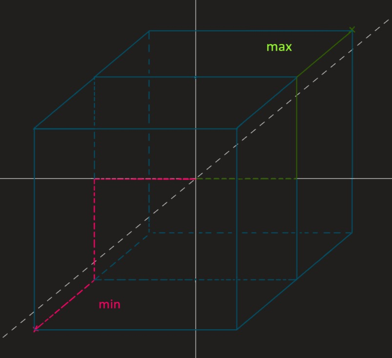
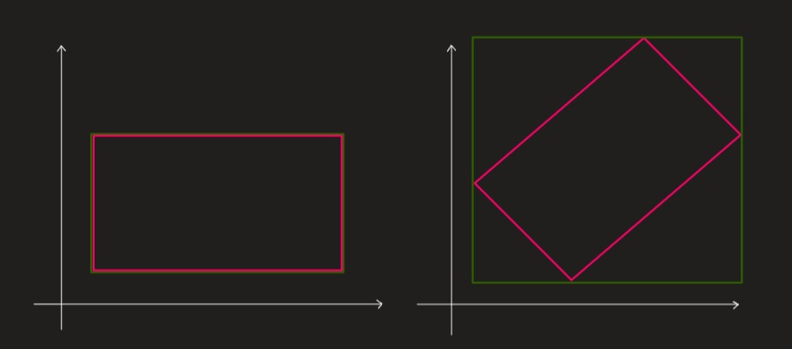

AABBf 

Work in progress

The Axis-Aligned Bounding Box is an efficient tool for collision detection.
A Bounding Box forms itself out of the minimal and the maximal x, y, z coordinates of an object.
The min and max values of a cube in the center of a scene may look like this:

```min = (-1, -1, -1); 
max = (1, 1, 1);```

A Bounding Box draws a cuboid as tightly as possible around the targeted object.
A sphere with radius 1 would have the same Bounding Box as the cube in the example above.



The Axis-Aligned Bounding Box is as the name suggests "axis-aligned", which means the Bounding Boxes are not able to rotate and if its object rotates the AABB has to be recalculated and may end up in a bad approximation of its former shape.
Therefore the AABB is most useful when the objects principal axes are roughly aligned with the scenes coordinate system.



When two Bounding Boxes are tested for a collision, the minimum values of one box are compared to the maximum of the other and vice versa (A.min.y & B.max.y,..., A.max.z & B.min.z,...). So if a minimum value is greater than a maximum value / a maximum value is lesser than a minimum value, a collision occurs.


Components ###

| Type          | Name                             |        Description                                                             |
|:-------------:|:--------------------------------:| ------------------------------------------------------------------------------:|
| ```AABBf```   | AABBf()                          | Creates a new axis aligned bounding box                                        |
| ```bool```    | Equals(B)                        | Indicates whether this plane is equal to another object                        |
| ```bool```    | Intersects(B)                    | Checks if this AABB intersects with another                                    |
| ```AABBf```   | ReferenceEquals(A, C)            | Determines whether the specified object instances are the same isntance        |
| ```AABBf```   | Union(A, B)                      | Calculates the bounding box around two exosting bounding boxes                 |
| ```int```     | GetHashCode()                    | Returns the hash code for this instance                                        |
| ```Type```    | GetType()                        | Gets the Type of the current instance                                          |
| ```bool```    | InsideOrIntersectingFrustrum()   | Checks if a viewing frustrum lies within or intersects this AABB               |
| ```bool```    | InsideOrIntersectingPlane()      | Checks if a viewing plane lies within or intersects this AABB                  |
| ```string```  | ToString()                       | Returns the fully qualified type name of this instance                         |
| ```float3```  | Size                             | Returns the width, height and depth of the box in x, y and z                   |
| ```float3```  | Center                           | Returns the center of the bounding box                                         |
| ```float3```  | min                              | The minimum value of the axis aligned bounding box in x, y and z direction     |
| ```float3```  | max                              | The maximum value of the axis aligned bounding box in x, y and z direction     |


Building your own Bounding Box ###

You can use the constructor 'AABBf' to build your own Bounding Box: #####


```_min = new float3(-1, -1, -1);
_max = new float3(1, 1, 1):

AABBf bb1 = new AABBf
(
    _min,
    _max 
);```


There is also a way to get the Bounding Box of an Asset or Object in the scene: #####


```private Transform SphereTrans;
private Mesh SphereMesh;

SphereMesh = Scene.Children.FindNodes(node =>node.Name == "Sphere")?.FirstOrDefault()?.GetMesh();
bb2 = SphereMesh.BoundingBox;```


If (at least) one of your object moves you can multiplicate it with the Matrix of the moving Object: #####

```AABBf movingBb = bb2 * SphereTrans.Matrix();```


Now if you want to check for a collision between these two Bounding Boxes, you can use the Intersect Method: #####

```if(bb1.Intersects(bb2))
{
    Console.WriteLine(Oh? You're intersecting me?);
}```